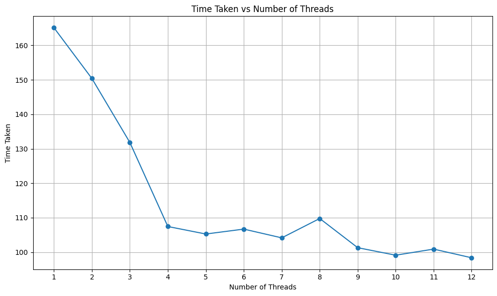

---

# Matrix Multiplication with Multi-Threading

## Introduction
This Python script demonstrates how to perform matrix multiplication using multi-threading. Matrix multiplication can be a computationally intensive task, especially for large matrices. By utilizing multi-threading, we can distribute the workload across multiple threads, potentially speeding up the computation.

## Libraries Used
The script uses the following libraries:
- `multiprocessing`: To determine the number of CPU cores available.
- `threading`: To create and manage multiple threads for matrix multiplication.
- `numpy`: To generate random matrices for testing.
- `os`, `sys`, `time`: Standard libraries for system-related operations and time measurement.
- `random`: To generate random numbers for matrix elements.

## Program Explanation
1. **Determining Number of CPU Cores**:
   - The number of CPU cores available in the system is determined using `multiprocessing.cpu_count()` function.

2. **Initializing Matrices**:
   - A list of 100 random matrices (100x100) is generated using `numpy.random.rand()` function.
   - A constant matrix (100x100) is also generated for multiplication.

3. **Matrix Multiplication Function** (`matrix_multiply()`):
   - This function performs matrix multiplication for a given pair of matrices.
   - It takes four arguments: `matrix`, `constant_matrix`, `result`, and `index`.
   - It initializes a temporary matrix to store the multiplication result.
   - The matrix multiplication is performed using nested loops.
   - The result is stored in the `result` list at the specified index.

4. **Multi-Threading**:
   - The script iterates over a range of thread counts from 1 to 12.
   - For each thread count, it creates multiple threads to perform matrix multiplication concurrently.
   - Each thread handles the multiplication of a single matrix.
   - The number of active threads is controlled to match the specified thread count.
   - The script waits for all threads to finish execution before proceeding.

5. **Time Measurement**:
   - The start time is recorded before each set of matrix multiplications.
   - The total execution time is calculated by subtracting the start time from the current time.
   - The execution times for different thread counts are stored in a list (`timelist`).

6. **Output**:
   - The script prints the number of threads and the total execution time for each set of matrix multiplications.
   - The execution times for different thread counts are printed at the end of the script.

|Threads| 1       | 2       | 3       | 4       | 5       | 6       | 7       | 8       | 9       | 10      | 11      | 12      |
|-------|---------|---------|---------|---------|---------|---------|---------|---------|---------|---------|---------|---------|
| Time  | 165.1075| 150.3768| 131.8193| 107.4519| 105.2726| 106.6965| 104.1603| 109.77  | 101.3076| 99.1295 | 100.8958| 98.3826 |

## Conclusion
This program demonstrates how multi-threading can be used to parallelize matrix multiplication, potentially improving performance for large-scale computations. The execution times for different thread counts can be analyzed to determine the optimal number of threads for a given workload.

---
